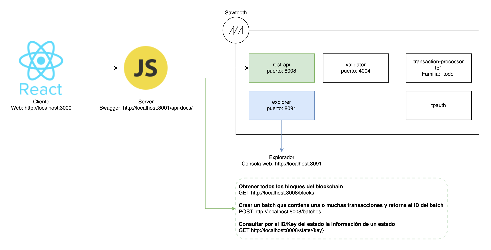

# ToDo blockchain example

## Requirements 

node v10
docker-compose

## Local deployment

```bash
./init.sh
./up.sh
./down.sh
```

## Architecture



## URLs

### Server

Servidor - Swagger:
[http://localhost:3001/api-docs/](http://localhost:3001/api-docs/)

### Cliente

App cliente:
[http://localhost:3000](http://localhost:3000)

### Sawtooth API

```bash
# Obtener todos los bloques del blockchain
GET http://localhost:8008/blocks
```

```bash
# Crear un batch que contiene una o muchas transacciones y retorna el ID del batch
POST http://localhost:8008/batches
```

```bash
# Consultar por el ID/Key del estado la información de un estado
GET http://localhost:8008/state/{key}
```

### Sawtooth explorer

Explorador, consola web:
[http://localhost:8091](http://localhost:8091)
