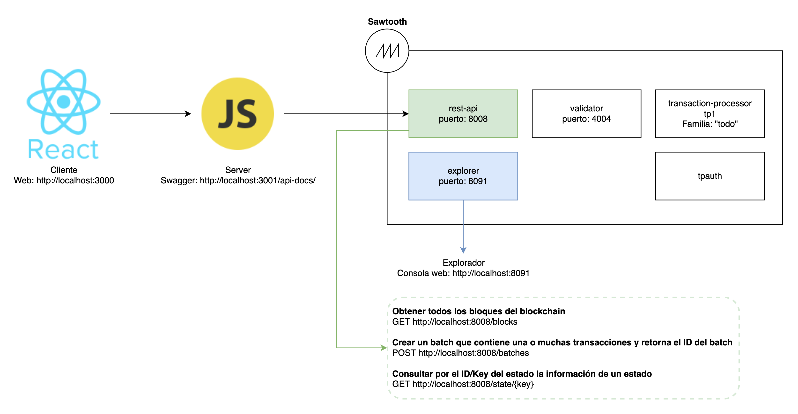

# ToDo Sawtooth

Este proyecto te permite crear un blockchain usando el framework de **Hyperledger Sawtooth**.

El transaction processor es creado de forma personalizada y la familia que usa se llama `todo`. La familia `todo` hace referencia a una lista de pendientes que comúnmente conocemos como "ToDo list". Cada transacción que se agrega en el blockchain va a hacer referencia a un pendiente dentro de la lista.

## Requerimientos 

* [docker](https://docs.docker.com/engine/install/ubuntu/)
* [docker-compose](https://docs.docker.com/compose/install/)
* [node 10](https://nodejs.org/en/download/) ... talvez funcione con node v12.

## Despliegue local

```bash
./init.sh
./up.sh
./down.sh
```

## Arquitectura



## URLs

### Cliente

Aplicación cliente, está desarrollada con React:
[http://localhost:3000](http://localhost:3000)

### Servidor

Servidor - Swagger, es un microservicio desarrollado en JavaScript:
[http://localhost:3001/api-docs/](http://localhost:3001/api-docs/)

### Sawtooth API

El API de Sawtooth permite crear transacciones (En bloques batch) y también consultar los bloques y los estados del blockchain:

```bash
# Obtener todos los bloques del blockchain
GET http://localhost:8008/blocks
```

```bash
# Crear un batch que contiene una o muchas transacciones y retorna el ID del batch
POST http://localhost:8008/batches
```

```bash
# Consultar por el ID/Key del estado la información de un estado
GET http://localhost:8008/state/{key}
```

### Sawtooth explorer

Explorador, ofrece una consola web amigable y permite consultar los bloques del blockchain:
[http://localhost:8091](http://localhost:8091)
